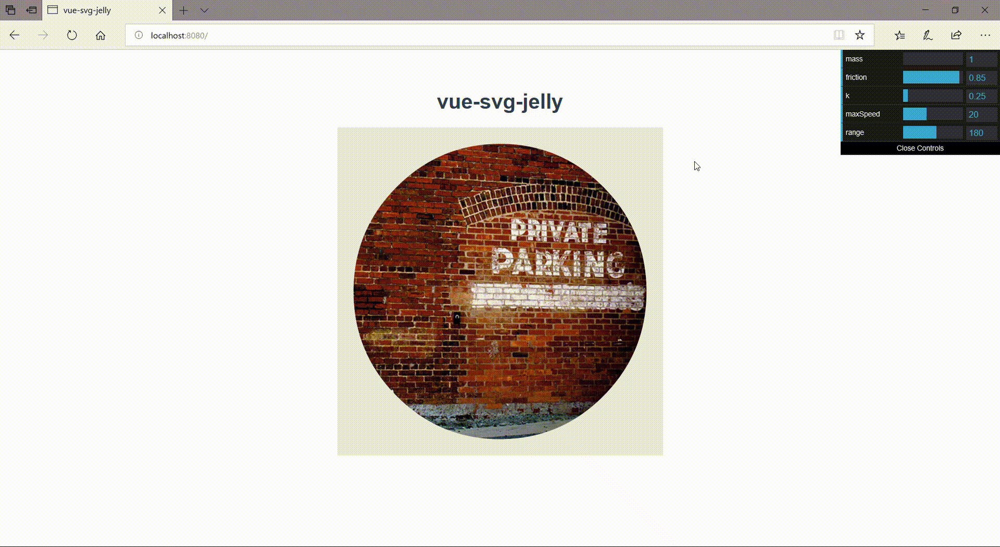

# vue-svg-jelly
<ul>
	<li><a href="http://yoshihitofujiwara.github.io/vue-svg-jelly/index.html" target="_blank">DEMO</a></li>
</ul>




___
## Usage

```
<template>
  <div id="app">
    <SvgJelly
      ref="svg"
      image="./assets/img/img02x500.jpg"
      path="M475 250 Q 475 343 409 409 Q 343 475 250 475 Q 157 475 91 409 Q 25 343 25 250 Q 25 157 91 91 Q 157 25 250 25 Q 343 25 409 91 Q 475 157 475 250"
      :options="{	mass: 1, friction: 0.85, k: 0.25, restLength: 0, maxSpeed: 20, range: 180}"
    />
  </div>
</template>

<script>
import SvgJelly from "./components/SvgJelly.vue";

export default {
  name: "app",
  components: {
    SvgJelly
  }
};
</script>

<style>
svg {
  height: 500px;
  width: 500px;
  cursor: pointer;
  background: #e9e9e9;
}
</style>

```

___
## Options

|Params|Type|Default|Description|
|----|----|----|----|
|image|String|undefined|<strong style="color:#f09">Required</strong> image path|
|path|String|undefined|<strong style="color:#f09">Required</strong> Relative d Commands <br> Convert Relative to Absolute <a href="http://snapsvg.io/docs/#Snap.path.toAbsolute" target="_blank">Snap.path.toRelative</a> |
|options|Object| | |
|options.mass|Number|1|Jelly Point Mass|
|options.friction|Number|0.85|Jelly Point Friction|
|options.k|Number|0.25|Spring Proportionality Constant|
|options.maxSpeed|Number|20|Spring Max Speed|
___

## Supports
- Chrome
- ~~Safari~~
- Firefox
- Edge
- IE 11
- Android Chrome
- ~~ios Safari~~
___


## Project setup
yarn or npm

```
yarn install
```

### Compiles and hot-reloads for development
```
yarn run serve
```

### Compiles and minifies for production
```
yarn run build
```

### Run your tests
```
yarn run test
```

### Lints and fixes files
```
yarn run lint
```

### Customize configuration
See [Configuration Reference](https://cli.vuejs.org/config/).
